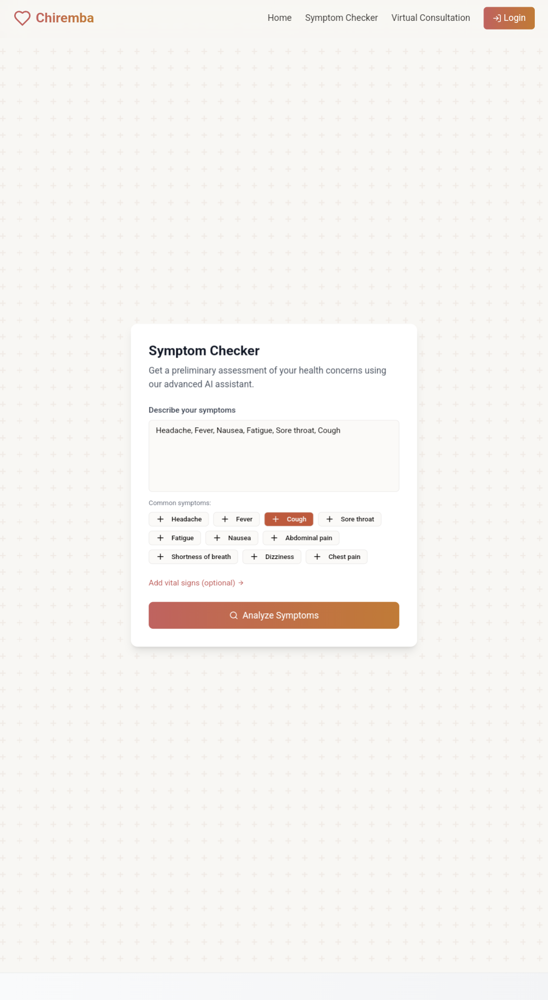
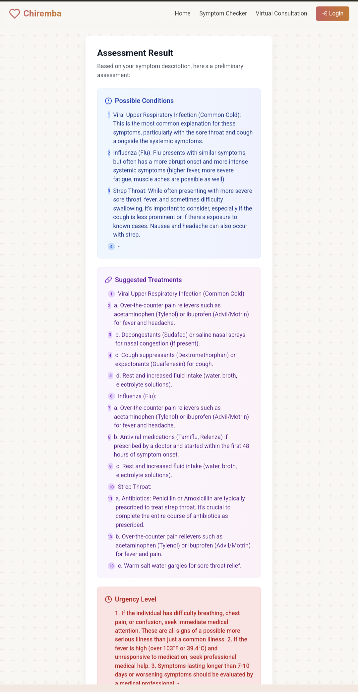
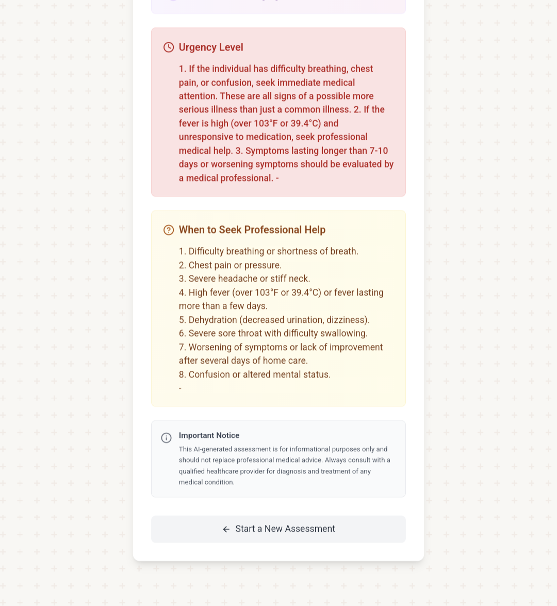
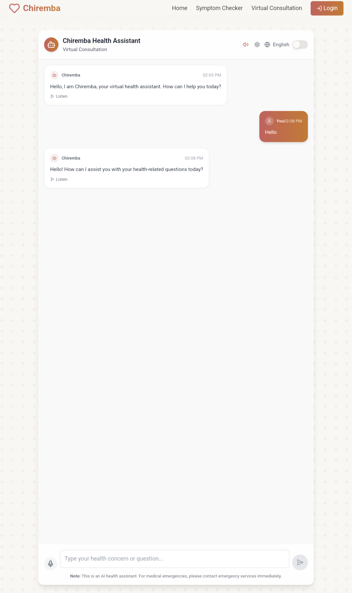
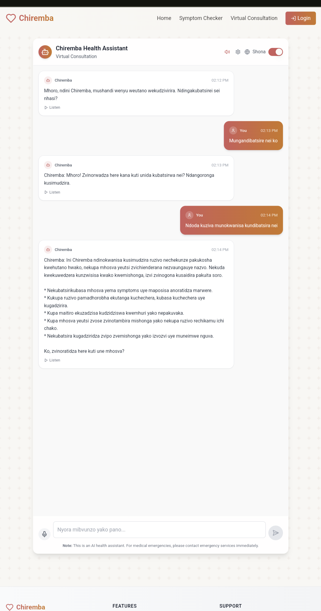
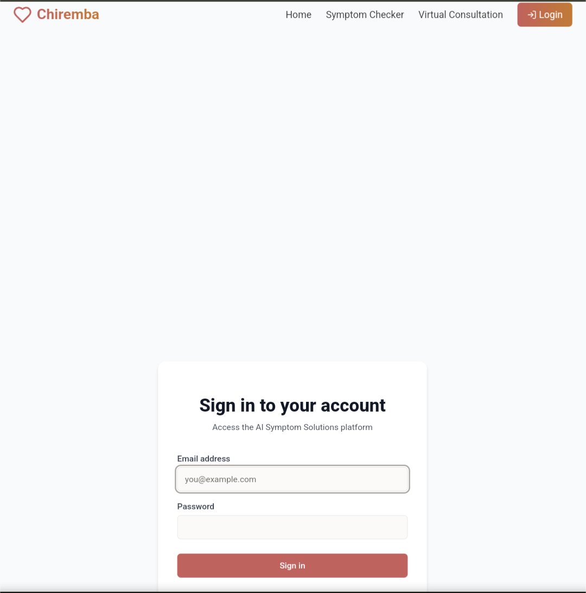
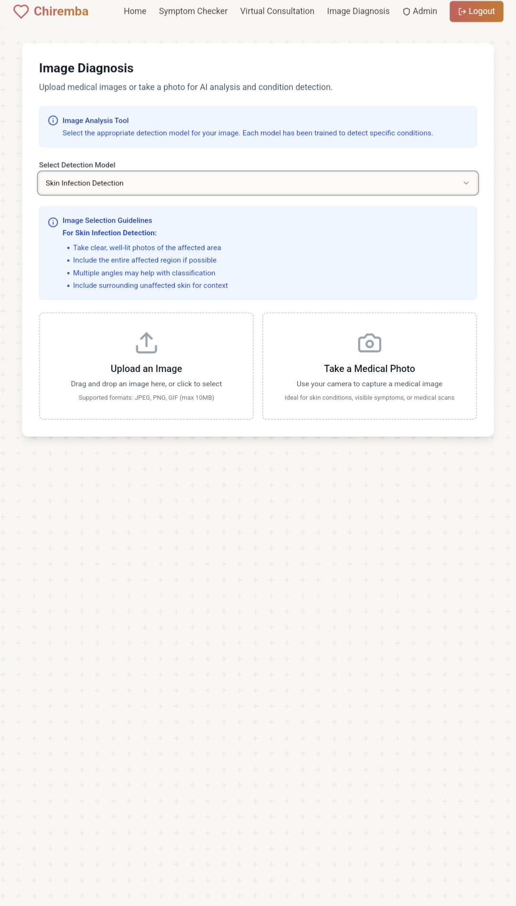
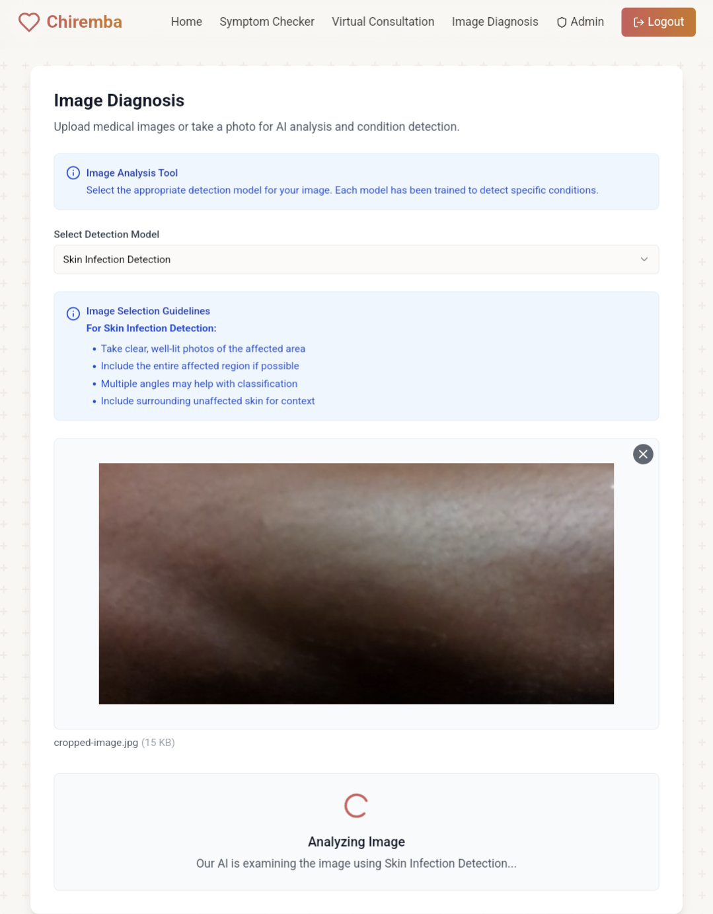
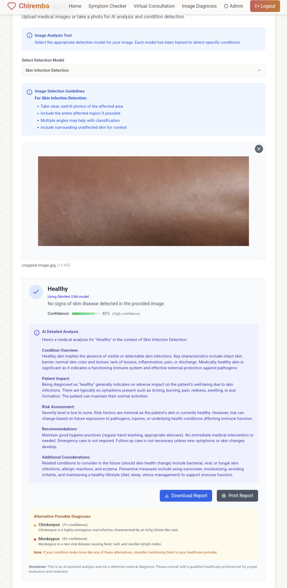

# Chiremba Frontend and Deployment

This directory contains the frontend application and deployment configurations for the Chiremba medical diagnosis system.

## Frontend Application

A modern React-based web application that provides an intuitive interface for medical image analysis.

### Features

- User-friendly interface for medical image upload
- Support for multiple diagnosis types:
  - Skin disease analysis
  - Brain tumor detection
  - Lung cancer screening
  - Pneumonia diagnosis
- Real-time analysis results
- Detailed medical reports generation
- Responsive design for all devices

### Technology Stack

- React with TypeScript
- Material-UI for components
- Axios for API communication
- Jest for testing

### Setup

1. Install dependencies:
```bash
npm install
```

2. Configure environment variables:
   - Copy `.env.example` to `.env`
   - Update API endpoints and configuration

3. Start development server:
```bash
npm start
```

4. Build for production:
```bash
npm run build
```

## Environment Variables

- `REACT_APP_SKIN_SERVICE_URL`: Skin service API endpoint
- `REACT_APP_IMAGE_DIAGNOSIS_URL`: AI backend service endpoint
- `REACT_APP_API_KEY`: API authentication key (if required)

## Deployment

The application can be deployed using the provided configuration files:

1. Docker deployment:
```bash
docker-compose up -d
```

2. Manual deployment:
   - Build the frontend
   - Configure Nginx using the provided configuration
   - Set up SSL certificates
   - Configure reverse proxy for backend services

## Directory Structure

- `/frontend`: React application source code
- `/nginx`: Nginx configuration files
- `/scripts`: Deployment and maintenance scripts
- `/config`: Configuration files for different environments

## Testing

Run the test suite:
```bash
npm test
```
## Previews

### **Home Page - Symptom Checker**
<div style="display: flex; gap: 10px;">
  
  
  
</div>

---

### **Virtual Chat**
<div style="display: flex; gap: 10px;">
  
  
</div>

---

### **Login**


---

### **Image Diagnosis**
<div style="display: flex; gap: 10px;">
  
  
  
</div>

## Contributing

Please follow the established coding style and commit message conventions when contributing to this project.
